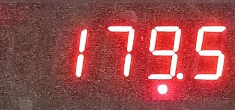
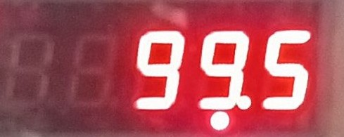
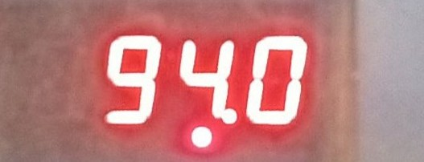

# Fast SSOCR: A12E Weight Scale Reader

A high-performance, lightweight FastAPI application designed to extract and format numerical readings from **A12E LED weight scale displays**.

## 📸 Demo
This project is specifically optimized to handle the 7-segment red LED output of the A12E indicator, accurately identifying weights even with glare or background noise.

| Case A (179.5 kg) | Case B (99.5 kg) | Case C (94.0 kg) |
| :---: | :---: | :---: |
|  |  |  |

## 🚀 Overview

This project provides a specialized OCR pipeline for 7-segment LED displays. It uses advanced image processing (**HSV Red-Dominance Masking**) to isolate glowing LED digits from complex backgrounds, followed by **EasyOCR** for high-accuracy character recognition.

## ✨ Features

* **Red-Dominance Masking**: Isolates glowing red LED segments while ignoring shadows, reflections, and scale casing.
* **Morphological Refinement**: Dilation and closing operations to bridge gaps in 7-segment characters.
* **Precision Formatting**: Automatically formats raw OCR output to match A12E standards (e.g., `1795` -> `179.5 kg`).
* **FastAPI Backend**: Ready-to-deploy RESTful API with automated Swagger documentation.
* **CPU Optimized**: Designed to run efficiently on standard hardware without requiring a GPU.

## 🛠️ Technology Stack

* **FastAPI**: Modern, high-performance web framework.
* **OpenCV**: Image processing (Color masking, Dilation, Pre-processing).
* **EasyOCR**: Robust optical character recognition.
* **NumPy**: Array processing for high-speed image manipulation.

## 📋 Installation

1.  **Clone the repository**:
    ```bash
    git clone [https://github.com/limkhysok/fast-ssocr.git](https://github.com/limkhysok/fast-ssocr.git)
    cd fast-ssocr
    ```

2.  **Install dependencies**:
    ```bash
    pip install -r requirements.txt
    ```

3.  **Run the application**:
    ```bash
    python main.py
    ```

## 🔌 API Usage

### Extract Weight
**Endpoint**: `POST /extract-weight/`

**Request**:
* `file`: Image file (JPG/PNG) of the weight scale display.

**Response**:
```json
{
  "raw_ocr": "1795",
  "formatted_weight": "179.5",
  "unit": "kg"
}
